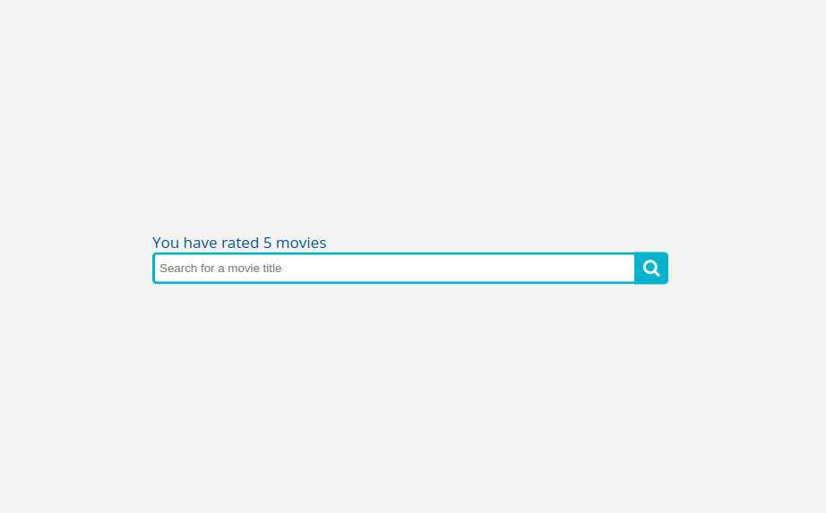

# movie-recommender
A movie recommender built using The Movie Dataset (from Kaggle).

## How it works

### The goal

The goal of this project was to create a simple yet functional movie recommender system. For the recommendations, it was expected that both movie metadata and user-related preferences were taken into consideration.

### The (very simple) user experience

- When accessing the service for the first time, you are prompted to input an username to identify yourself and your ratings.
- Then, you can search for movies based on the title:

- In the search results, you may enter rating values (0 to 5) and rate movies or click the recommend button:

- When you click the recommend button, the algorithm described below is used to retrieve recommendations. Note that when a user vector is not available (not enough ratings), only keyword search is used:

### Design choices

Pretty much all data is stored and handled using a PostgreSQL database for its simplicity and concurrency handling. The amount of shared state was minimized when possible, however a few components store important data in memory.

The recommendation algorithm itself is a two-stage model that works as follows:

- Recommendations are requested for a given movie;
- Movies with at least one genre is common are retrieved (first stage). This lookup is done in-memory for speed;
- Among those movies, two similarity metrics are used:
    1. Keyword searcher: overlap between two keyword "soups";
    2. KMF searcher: The predicted rating for each movie given by a KMF (kernel matrix factorization) model.
- The top recommendations returned by each metric are then combined into one output and returned to the user.

### Details about the Keyword Searcher

The keyword "soup" includes the movie ID, the genres, movie keywords, cast and director. This soup is vectorized. However, the distinct number of tokens is, of course, massive. Thus, sparse matrices are used to fit the data into memory. The similarity metric is simply the cosine similarity between different movie vectors.

### Details about the KMF Searcher

Kernel Matrix Factorization is a generalization of the common [SVD](https://surprise.readthedocs.io/en/stable/matrix_factorization.html#surprise.prediction_algorithms.matrix_factorization.SVD) algorithm used for collaborative filtering. The main change here is that a kernel function is applied. In our case, the sigmoid funtion is used to bound the predictions to the valid range. The model is trained using stochastic gradient descent in PyTorch. The recommended movies are simply those with the largest predicted scores.

The training objective is to predict the rating each user gave to a movie as a product of two vectors (movie and user vectors) plus their corresponding biases. A global bias is added due to the sigmoid kernel to allow shifting the mean.

This kind of model has proven to produce good results. However, when new user ratings arrive, the model would need to be trained again from scratch. In the current state, this system uses a small ratings dataset so that the training is very fast, but in live systems the number of ratings would grow rapidly. This makes retraining the entire model for every new (batch of) rating not feasible.

The solution was found in [this paper](https://doi.org/10.1145/1454008.1454047), in which they present an algorithm for online-updating the user vectors and biases. In summary, the movie vectors are fixed and only the user vector is updated using gradient descent. This allows updating an existing user vector with new ratings as well as adding new users without retraining the entire model every time.

New ratings are kept in memory. When a threshold is reached for a given user, an online-update training step updated that user's vector and bias information. The drawback of this approach is that data can be lost since it's in memory. It's also written to the database, so all data will eventually be incorporated into the model when a new full-training happens.

## The dataset

Please download the data from [Kaggle](https://www.kaggle.com/datasets/rounakbanik/the-movies-dataset). Version 7 was used to develop this project and it's not guarateed to work with future versions. Download the CSV files and save them to the ./data folder inside this project's folder.

Please note that by default the service only uses ratings_small to speed up data import and model training, so the large version of this file are not required. Please note that using the full dataset requires much more memory for model training.

## Developing environment

All dependencies are on requirements.txt. Note that torch is commented out since CPU or GPU version might be wanted and thus it should be installed separately.

### Running with Docker

    docker-compose rm && docker-compose  up --build -d && docker-compose logs --tail 100 -f

The service will be available at http://0.0.0.0:8383/

### Running outside Docker for development and debugging
1. You must have a running local postgres instance and fill it with the data. To do this, please run:

    bash prepare_local.sh

2. Start the service (this requires all the dependencies, including pytorch which is commented out from the requirements)

    bash run_locally.sh

3. The service is available at http://0.0.0.0:8000/

### Testing

export PYTHONPATH=.:app
pytest .
